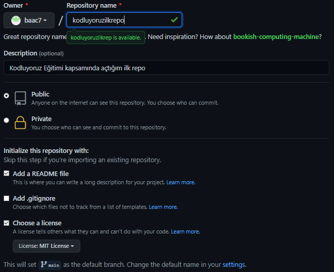

# Kodluyoruz İlk Repo
Bu repo [Kodluyoruz](https://www.kodluyoruz.org/) Front-End Eğitiminde oluşturduğumuz ilk repo. İçerisinde bir adet README dosyası, bir adet de index.html barındırıyor.

# Installation
Öncelikle projeyi klonlayın.<br/>
`git clone https://https://github.com/baac7/kodluyoruzilkrepo`
# Usage
Projeyi cloneladıktan sonra Visual Studio Code programında açınız.<br/>
Linux için:</br>
```
cd kodluyoruzilkrepo
code .
```
# Contributing
Pull requestler kabul edilir. Büyük değişiklikler için, lütfen önce neyi değiştirmek istediğinizi tartışmak için bir konu açınız.
# License
[MIT](https://choosealicense.com/licenses/mit/)